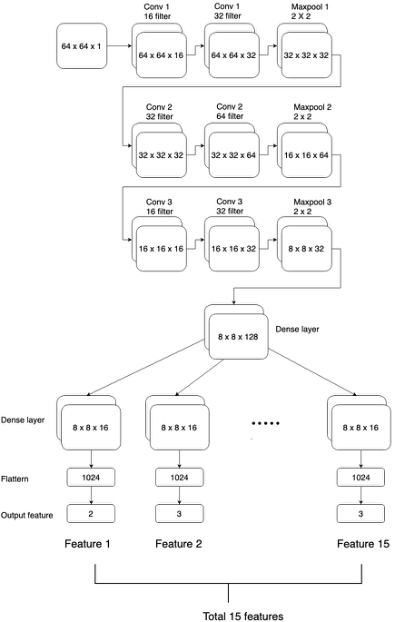

This project mainly aims to use different approaches to verify the writer of handwritting images. 

## Task 1 Annotating data

## Task 2 Bayesian network
Use structural learning to find best Bayesian structure given the 15 annotated features one handwriting image. In order to 
verify whether two given images are written by the same writer, the same Bayesian network structure is used for the two images and a verification node which has binary value is created. So there are totally 31 feature node in the full Bayesian network. One or more correspondant node pairs in the networks of two images are conneted to the verificaiton node. For example, 12th nodes in both networks are linked to the verification node. 

The full network is trained by Maximumlikelihood esitimator to get all CPDs. Then, it can proceed query tasks: input 15 times 2 feature values to the network, and output a binary value from verification node.

## Task 3 Deep learning approach
A Siamese network is used in this task. The basic idea of Siamese network is that the two input image array share a series of convolutional and max-pooling layers. After the share network, the calculated two groups of latent variables are fed into constative loss layer to minimize the contrastive loss.

The constrastive loss is defined:

contrative_loss=label{true}\*dist(left, right) + (1-label{true})\*max( margin - dist(left,right), 0)

dist(left,right) meassures the Euclidean distance between the outputs of share network for the two images. If label is true which means left and right image has the same writer, dist(left,right) should be as smaller as possible. If label is false, dist(left,right) need to be large. 

Siamese network works well with imbalanced data. In the dataset of this project, the handwritting image of some writers may have much fewer number than others, in which Siamese does better.

## Task 4 Explainable learning
A multitask deep learning model is used for this purpose. It can be divided into two parts. The first part contains several convolutional and max-pooling layers that are used for feature extraction. The second part contains 15 fully connected network whose inputs are the embeddings from the first part and outputs are 15 categorical values. 
  

The explainability lies in the embedding of first part network and 15 feature network. The cosine similarity of embeddings in first part network for two images can determine if they are from same or different writer. The embeddings of 15 feature network can help to expain why they are from same or different writer.
