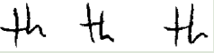

# Handwriting formation analysis

Use probabilistic graphical model to analyze handwriting formations. Constructed different graph structures and evaluated their likelihood based on dataset. Found the most and least probable formation using ancestral sampling approach.

Consider two letter "th" in this study. Six features of this pattern are defined as
-  Height relation of t to h
  - t shorter than h
  - t even with h
  - t taller than h
  - no pattern
- $x_2$ Shape of loop of h
  - retraced
  - curved right side and straight left side
  - curved left side and straight right side
  - both sides curved
  - no fixed pattern
- $x_3$ Shape of arch of h
  - Round arch
  - pointed
  - no set pattern
- $x_4$ Height of cross on t staff
  - Upper half of staff
  - lower half of staff
  - above staff
  - no fixed pattern
- $x_5$ Baseline of h
  - slanting upwards
  - slanting downward
  - baseline even
  - no set pattern
- $x_6$ Shape of t
  - tented
  - single stroke
  - looped
  - closed
  - mixture of shapes

